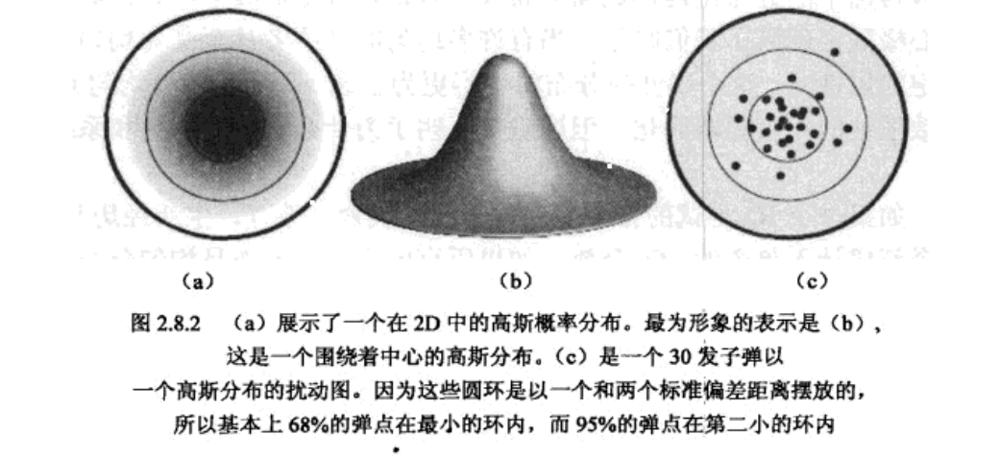

# 使用高斯随机性来你真发射轨迹的变化

## GRNG 高斯随机数生成器

* polar-rejection(最流行)
* Ziggurat（更快，不过因为使用了查询表，实际占用了cpu反而使游戏更慢）

不过以上方法对程序都不太好，最佳的方式是中心极限定理（central limit theorem）。
有时候也叫均匀数和（sum-of-uniforms）
使用一些像rand之类的函数并且相加，根据中央极限定理，这些均匀数和将出现高斯分布。
K个在区间[-1, 1]的随机数相加取平均将会出现标准差为 sqrt(K/3)的高斯分布

## 应用

可以模拟射击的随机性

多个同行的人或者物体，可以通过GRNG来产生真实的不同步的感觉

自然中的高斯分布，人类的IQ或者各种东西都是根据高斯分布来的。