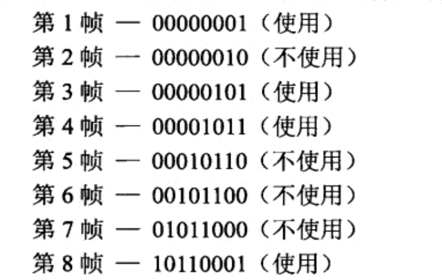
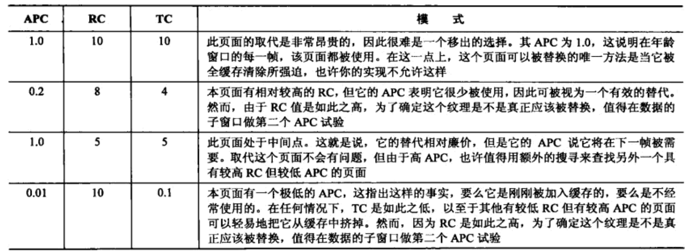

# 在年龄和成本指标的高效缓存替换

## 在游戏中使用缓存替换算法来进行缓存替换

**Belady的Min OPT算法**
最有效的算法就是在移除到缓存之外之后，最长一段时间不再会使用的到的内容。
但是这个实际上是不可能确定的。
如果有生产消费者结构的多线程环境，可以通过生产者线程来预测OPT结果

**最近最少使用 LRU算法**
在新的页面加载到缓存的时候，按页保存多久没有使用的数据。
如果缓存未命中就会替换最长时间跨度中未使用的页面。
不过容易抖动，因为你始终有一个最旧的页面，如果加载量非常大，可能会把所有的缓存都替换一遍。

**最近使用的 MRU算法**
替换刚刚被替换的界面，也就是缓存中的最新页面。
这个主要是为了防止严重抖动。在LRU算法达到抖动点时，使用MRU算法进行替换，这样可以避免缓存抖动的问题。

**不经常使用的 NFU算法**
NFU的做法是在每个页面添加一个访问计数器，任何当前时间间隔内访问的页面，计数器+1。
替换页面的时候在当前时间间隔内有最小计数器的页面将会替换。

这个做法的问题是，访问模式无法跟踪，如果在一开始频繁使用是，之后再也没用过的话就可能一直在内存中，但是不使用。

可以通过搜索Page Replacement algorithms搜索更多的缓存替换算法

## 年龄和成本指标

**年龄算法**
年龄算法通过记录前几帧的使用情况来模拟这个过程，我们需要掌握在一个时间窗口中一个页面被访问了几次。
这个时候我们在缓存；里面留下了32位的整数位置。

通过这样的信息结构我们可以知道指定时间窗口的年龄百分比费用（APC）。
在确定替换页面的时候，需要去确定其APC代价。

* 纹理需要证明自己是被场景需要的
* 建立暂存区，还没有证明是有用的纹理被转换为暂存区，
* 这个实际上是NRU算法的改进版本。如果一个纹理在前面频繁被使用而后续没有被使用的情况也可以很快被察觉到。

通过分析二进制的格式可以来了解其使用模式来更好地进行内存优化。

**扩展的年龄算法**
前面的算法虽然好，但是也会有如果所需页面数额相当大的情况下算法会退化。
这会导致不断加载和重复加载。
每个页面的计数器都会变成数字为1的计数器。
为了解决这个问题，可以比每帧储存一位更多信息，将每帧的使用次数储存下来，在退化的情况下这一额外信息特别有用。

* 非零轴总数/总帧数 还是可以得到原来的年龄算法的数据
* 通过使用次数找出使用最少的页面，有助于确定替换页面
* 利用MAX分析，可以确定访问最多的页面，防止被替换

根据自己的游戏情况选择算法。

**替换成本（RC）**
例如大型的纹理在替换的时候成本往往会比较大，我们可以将每个资源都定义成本，根据这个成本决定是否需要替换。
例如天空盒每一帧都是使用到，而且是大尺寸的，所以成本会比较大，帮助你回答，五个小纹理的清楚换一个大纹理是否是划算的。

**年龄和成本（APC&RC）**
我么可以通过APC和RC组合去判断替换一个页面是否是划算的。
例如：ThrashCast = APC * RC

如果你的缓存包含从每一个镜头角度都能看到的纹理，例如天空盒或者是角色贴图，这会造成更多的缓存未命中。
建议将这些静态纹理生成单独的缓存。

## 结论

算法的指标

* 高命中率
* 低抖动

一般需要大量定制和二次分析，才能获得最佳的效果