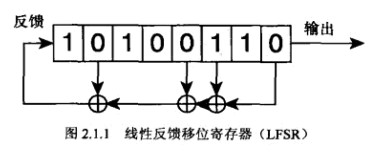

# 随机算法

## 应用

* AI算法，比如遗传算法和自动化的对手
* 随机游戏内容
* 天气、火焰
* 数学方法，蒙特卡洛积分
* 加解密算法，RSA使用随机数生成关键码
* 气象模拟和其他统计物理测试

随机数生成器又分硬件生成和为随机数生成器

常见分布：
* 均匀分布
* 高斯分布

## 随机性测试

DIEARD测试集

## 软件漂白

随机源经常有偏向性，比如时间，这个时候就需要漂白算法进行漂白

* 取两位，01 -> 1 10 -> 0
* 每隔一位取反，去除均匀偏向性
* 用另一个随机数做异或操作
* 使用Whirlpool或者RIPEMD的加密算法，MD5并不安全

## 不加密随机数算法

**平方取中法（已过时）**
统计有缺陷，不再使用

**线性同余算法**
数列 : Xn+1 = (a x Xn + b) mod m
其中a与b是常数,m是一个2的乘方
连续点线性相关，或者最低几位几乎不变。
优点是比较快，而且使用比较小的状态


**截断性线性同余生成器**
内部状态的Si是由LCG得到的。
依次输出Xi
Sn+1 = (a * Sn + b) mod m
Xn+1 = Floor(Sn+1 / K)

避免了LCG中低位的缺陷，K是2的乘方的话操作很快。
但是它也是不安全的，得到两个连续输出即可被破解。

**线性反馈移位寄存器LFSR**
将一个内部状态一次一位地移出来产生随机为，新的数位再重新移入当前状态。
它非常快速，但是不安全。


**逆同余生成器**
Xn+1 = (1/(a * Xn) + b) mod m
取逆操作很耗时，所以不常用

**滞后斐波那契生成器**
Xn = (Xn-j * Xn-k) mod m
乘法可以替换成其他的二元运算

这个算法很难良好运行，也很难初始化。因为马特赛特算法和新的生成器出现，这个算法已经抛弃。

**细胞自动机**
略

**线性递归生成器**
LFSR的泛化，现在大部分二进制有限域的快速随机数生成器都是由其衍生而来。

**马特赛特旋转法**
马特赛特旋转算法是一个旋转广义反馈移位寄存器，它不是密码安全的。

**LFSR113、LFSR258**
下面的C++实现返回一个32位值

```C++
unsigned long z1, z2, z3, z4;
/* 注意种子必须满足 z1 > 1, z2 > 7 z3 > 15 z4 > 127的条件 */
//产生随机的32位数字
unsigned long lfsr113(void){
    unsigned long d;
    b = (((z1 << 6) ^ z1) >> 13);
    z1 = (((z1 & 4294967294) << 18) ^ b);
    b = (((z2 << 2) ^ z2) >> 27);
    z2 = (((z2 & 4294967288) << 2) ^ b);
    b = (((z3 << 14) ^ z3) >> 21);
    z3 = (((z3 & 4294967280) << 7) ^b);
    b = (((z4 << 3) ^ z4) >> 12);
    z4 = (((z4 & 4294967168) << 13) ^b);
    return z1 ^ z2 ^ z3 ^ z4;
}
```

它也是良好分布的。

**WELL算法**
可以牺牲周期长度来换取比较小的状态。
大周期的WELL算法只有在天气建模和地球模拟的计算中才会用到。
WELL的算法比MT19937稍慢，而优点是随机数质量高而且代码简单。
下面这段代码比L'Ecuyer网站上的实现快40%比Matsumoto网站上的MT19937快40%

```C++
/* 初始化状态到随机位 */
static unsigned long state[16];
/* 初始化必须为0 */
static unsigned int index = 0;
/*返回32位随机数*/
unsigned long WELLRNG512(void){
    unsigned long a, b, c, d;
    a = state[index];
    c = state[(index + 13) & 15];
    b = a ^ c ^ (a << 16) ^ (c << 15);
    c = state[(index+9)&15];
    c ^= c >> 11;
    a = state[index] = b^c;
    d = a^((a << 5) & 0xDA442D20UL);
    index = (index + 15) & 15;
    a = state[index];
    state[index] = a ^ b ^ d ^ (a << 2) ^ (b << 18) ^ (c << 28);
    return state[index];
}
```

## 加密的RNG方法

密码安全的PRNGS(CSPRNGS)让攻击者即时获得大量输出也很难破解。大部分能在网上找到。
关于随机性的RFC文件是RFC1750和RFC4086。

**Blum Blum Shub**
Sn+1 = (Sn * Sn) mod m
其中m=pq，p和q是两个选择合理的大素数。
依赖于整数因式分解，Blum Blum Shub只是需要在加密是使用，因为它比不加密的PRNG要慢很多。
因为两字因式分解很快，所以量子计算机可以破解

**ISAAC、ISAAC+**
RC4密码变体的CSPRNG。

**/dev/random**
基于系统熵的随机数，可以视为真随机数生成器。
虽然不阻塞的方法不这么安全但是还是很受青睐

**微软的CryptGenRandom**
也是真随机数生成器，虽然未开放源文件，但是通过的FIPS验证。
不错的CSPRNG

**Yarrow**
使用系统熵来生成随机数的算法，免费。
Max OS X和FreeBSD都使用Yarrow实现了/dev/ramdom

**Fortuna**
使用一个熵池来手机对系统有效的随机源信息。因为是外部熵，所以视为真我战场数生成器。

## 随机数生成器的常见问题

**Knuth**
Knuth尝试制作自制RNG，但是在7401个值后陷入循环
不要在重要程序中使用自制的RNG

**RANDU**
LCG(2^3165539, 0)
线性相关的缺陷,所有点都在平面上

**Netscape**
由于种子没有散布开，导致随机数缺陷。

**民间算法**
将PRNG放入工具库前最好看看表现是否符合预期

