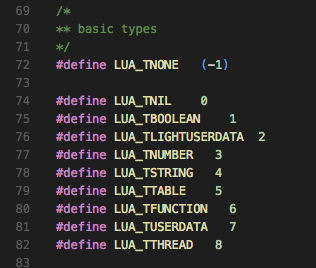
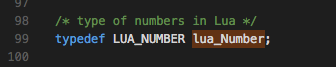
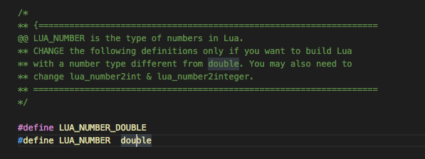
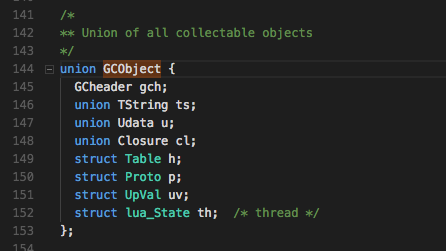
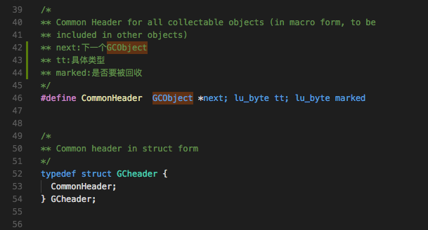
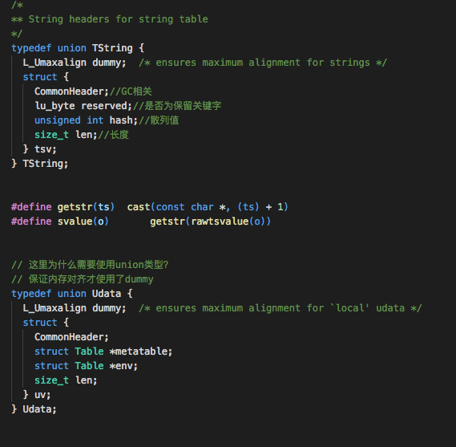
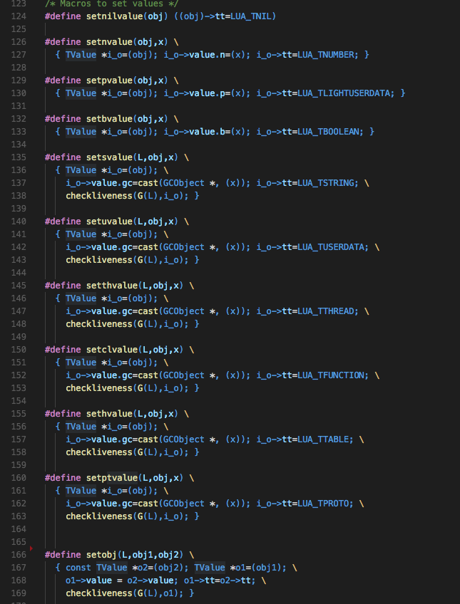

# Lua中动态类型的实现

最近在阅读《Lua的设计与实现》

里面讲到了很多Lua语言的实现细节。我也写写文章，以加强印象。

Lua是一种动态类型语言。所以要入手Lua源码，从类型定义开始确实是一个不错的切入点。

C++中的union结构可以在同一块内存当中存取不同类型的值或结构，Lua在类型实现当中大量使用了该结构。

首先在lua.h中我们可以看到Lua对所有基本类型的定义。

除了空类型LUA_TNONE之外的基本类型有：

空类型、布尔型、指针、数字、字符串、表、函数、UserData、协程

在lobject.h中我们可以看到所有类型的定义。

在Lua中根据数据类型是否需要进行垃圾回收将数据分为了GCObject与其他数据。

在lobject.h中我们可以看到这样的数据结构

我们可以看到Value类型中有一个GCObject的指针，其实这个对象就包含了所有需要进行垃圾回收的对象。

至于另外几个我们可以看到

一、*p就指的是轻量级的指针、

二、n的luaNumber通过查找定义就可以看到其实它就是一个double类型。

在luaconf.h中可以将double改成其他的数据类型以满足我们的需要。

三、b的int则代表了lua中的整型。

这样我们就可以通过Value来表示GCObject和所有不需要进行垃圾回收的数据类型。但是GCObject需要继续细分，我们将会看到GCObject也是一个联合体。

 

接下来我们就来看GCObject里面包含了什么。

在lstate.h中包含了GCObject的定义。

暂时先不管GCObject中的GCheader到底是什么，我们就先看下面的几个数据类型吧。

我们可以看到下面的所有数据类型都是lua的基本类型，包含了字符串、UserData、闭包、表等等。这些都是在Lua中需要进行垃圾回收的对象。

通过union我们可以用这种数据结构来表示所有这些类型。

那么GCheader是什么呢？

GCHeader其实就包含了一个CommonHeader，那这个CommonHeader是什么？

其实这指代了垃圾回收对象当中所有需要的数据，包括GCObject指针、数据类型、以及垃圾回收标志。

在阅读代码的过程中我们也会发现在字符串、Table等类型中都是以CommonHeader开头的。

因为所有的GC对象都以CommonHeader开头，所以某种程度上，这些所有类型都继承自CommonHeader。

所以在GCObject中的gch是为了无差别地对待所有的GC对象，也就是所有GC对象的父类（虽然在这里并没有面向对象的概念，但是从实现上来说是一样的）

 

到现在为止，所有的对象已经能够被统一的数据结构——Value表示出来了，但是Value并不是自省的，也就是它并不知道自己是什么类型的，所以最终Lua又最后封装了一层，

也就是在lobject.h中封装的TValue：

value代表了值，而tt则是表示其类型，帮助lua识别数据是何种类型。

 

Lua的通用数据组织结构总结：

上方的数据结构被下方的数据结构所包含。

 

### CommonHead：//用于表示GC对象的通用数据

GCObject *next//下一个指向的GC对象

lu_byte tt//具体类型

lu_byte marked//GC标志代表是否需要被回收

### GCHeader：//用于表示GC对象的统一数据结构，便于查找

CommonHeader

### GCObject：//GC对象联合体，用于表示任何一个需要进行垃圾回收的对象

GCheader gch//可以表示任何一种GC对象类型

TString ts//字符串

UData u//UserData

Closure cl//闭包

Table h//表

Proto p//存放函数原型的数据结构

UpVal uv//上值

lua_State th//虚拟机/协程

### Value：//GC对象与基本对象联合体，用于表示所有的lua基本类型

GCObject *gc//GC回收对象

void *p//指针

lua_Number n//浮点数，默认为double

int b//整型

### TValue://自省的Lua数据类型

Value value//任意基本类型

int tt//类型标识符

实际在lua内部还需要根据不同类型进行不同操作，虽然在使用lua的时候是不需要知道其类型的，值得类型会随着赋值而进行变换，但是在内部操作的时候还是需要转成特定的类型。

毕竟C不是动态类型的。

所以在lobject.h中定义了每种类型设值得类型转换方法。

内部大量的数据转换操作让lua在使用中做到了可以将任意类型塞入到同一个变量当中。

也促成了动态类型语言的优势。

 

总的来说Lua的数据结构大体就是这样。