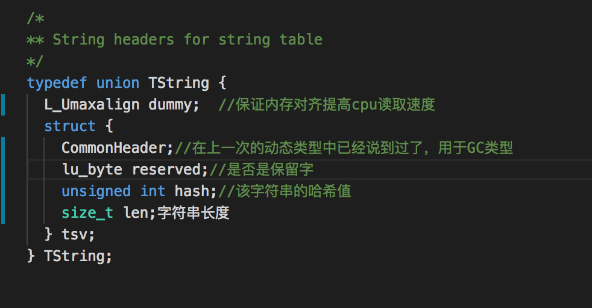
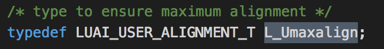
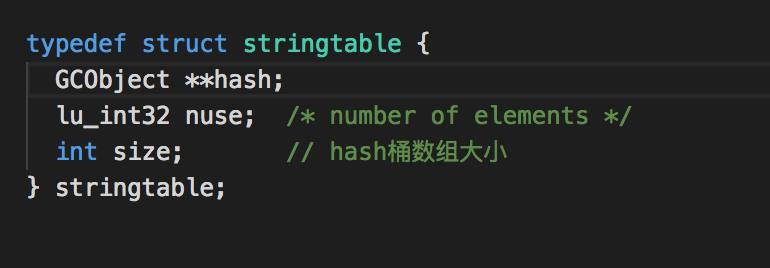
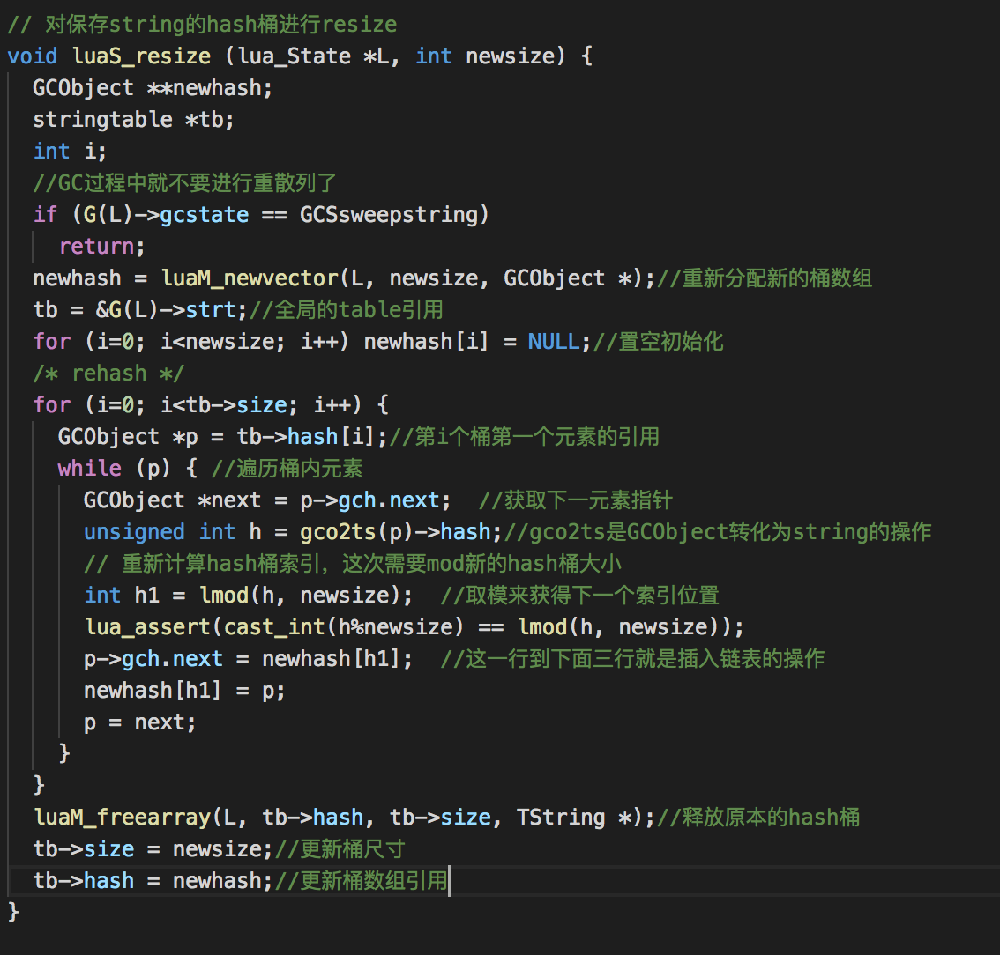
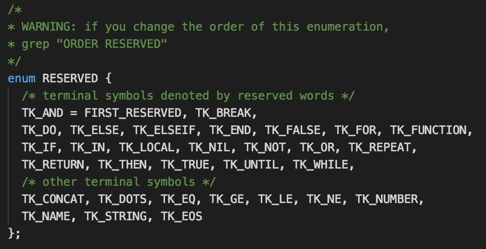
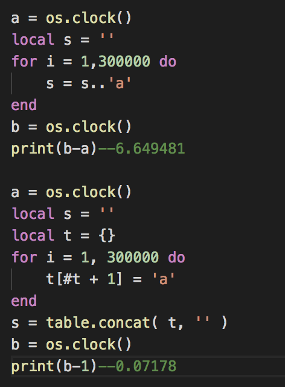

# Lua中字符串的实现

## 概述

在各种C++的库中可能会实现很多套string。Lua则是将string这个类型进行了内化，也就是内部实现了一套自己的string管理。

在Lua中每个不同的字符串在内存中都只有一份引用，这其实和C#一样，字符串其实本身是不可变的，当操作字符串的时候并没有改变字符串本身，而是改变了对字符串的引用。如果字符串没有收到其他任何引用的话则会被GC回收。

用过Unity的开发者肯定知道，不要经常使用“+”操作符来连接字符串，而是使用StringBuilder来进行缓存，同样的Lua中也有同样的优化方式，那么我们就来看看Lua中字符串的实现方式。

既然我们要获得不同字符串的引用，那么必然地Lua就需要在一个地方存放字符串。Lua在实现当中大量使用了散列桶，当你读到Lua中table的实现的时候也是用散列桶。Lua通过这样的方式内化字符串之后可以很快地进行字符串比较等操作，而且内存中每种字符串只会存在一份，在内存优化上也比较有优势。

不过在后面的源码中我们会发现，创建字符串的时候需要寻找是否已经存在该字符串。但是相较它带来的好处，这个缺点并无大碍。

## 源码阅读

基本上lua中基本类型与数据结构都在lobject.h中进行了实现。string类型也不例外：

简单来看一下：

首先TString是一个struct/union，这样的实现是为了让TString按照L_Umaxalign进行类型对齐。我们后面会稍微讲一讲。

struct就是字符串真正要用到的部分，

* ommonHeader:在上次的文章中已经有谈到，就是用于GC的通用头
* reserved:标识该字符串是否为lua语言的关键字，它将不会被垃圾回收
* hash:代表的是该字符串的hash，用于比较操作
* len:就比较好理解，就是字符串的长度了

我们看下dummy这个字段，找到L_Umaxalign的定义：

 
 

网络上有很多内存对齐相关的文章，大家可以自行搜索。

我自己本身C++水平其实也很拙计，我当时是看的这一篇：

<http://www.cnblogs.com/jijiji/p/4854581.html>

引用文章中的话，总的来说就是两点:

 平台原因（移植原因）：不是所有的硬件平台都能访问任意地址上的任意数据，某些硬件平台只能在某些地址处取某些特定类型的数据，否则抛出硬件异常
硬件原因：经过内存对齐之后，CPU的内存访问速度大大提升。
lua在此处使用这样的写法应该也是出于这样的目的。

那么string现在已经有了自己的结构定义，那么我们前面所说的全局储存string的地方又在哪里？

其实就是在lstate.h中，这部分的代码基本上都是用于实现全局状态机的。

我们查找一些stringtable的引用，会发现在全局状态机中有一个存放stringtable的地方：

可以看到strt，就是存放全局stringtable的地方。

根据寻找lua源码的上下文引用，我们就可以知道这几个字段分别是什么意思：

hash:用于储存字符串
nuse:存在的字符串的总数
size:散列桶数组的大小
当分配一个字符串的时候，首先会算出字符串的散列值作为索引值，如果strt中没有该索引则新建散列桶，如果已经有元素则将这几个同样索引的字符串用链表串起来。

string散列堆操作的代码基本都放在了lstring.c中。

## 申请字符串

在lstring.c中定义了申请新字符串的操作：

luaS_newlstr主要用于判断是否已经存在相同的字符串，如果有就直接返回。

下面就看看实际上分配字符串内存的实现：

## 重散列

但是这个时候又要考虑到，如果同样桶中的字符串数量过大的话，索引复杂度又趋于线性，这个时候就需要进行重新算散列的操作以保证字符串查询的高效性。在table的实现当中也会用到重散列来保证索引的高效性。

其中有一个rehash的函数：

里面涉及到的gch其实在上一篇中也提到过，是GC对象的通用容器（也能算是父类吧某种程度上）其中的链表操作也比较简单。

resize操作引用到的地方有两个，也就是申请与释放：

lgc.c中的checksize函数：释放之后发现桶数量太大，搜索成本趋于线性，则进行resize操作
lstring.c中的newlstr：申请字符串之后发现桶太少，搜索成本趋于线性，则进行resize操作
保留字的处理
我们之前也看到了lua字符串中有保留字的字段判断是否为保留字。

在词法分析的时候lua必须知道有哪些保留字，所以词法分析的实现其实放在了llex.c中。

别的我们也不看，就只看保留字相关的代码：

在llex.h中其实我们已经可以看到保留字对应的enum枚举和在llex.c中的具体字符串了：

 

enum与luax_tokens一一对应。值得注意的是 number , name , string , eof 并不针对一个具体的保留字，而是针对一个类型的token，为了统一便也加上了字符串定义。

在luastate初始化的时候会将保留字加入到全局字符串表并且设置为不可回收：

查看该函数的引用：

可以看到初始化的过程。不过因为该文章主要讲字符串就不讲虚拟机初始化的过程了。

## 字符串性能优化

之前也有说到，C#中可以通过StringBuffer来减少string操作带来的GC。同样的在lua中也可以通过table来降低字符串操作带来的消耗。

下面的例子来自《Lua的设计与实现》

我们可以看到通过table对字符串进行缓存提升了近9倍的性能。