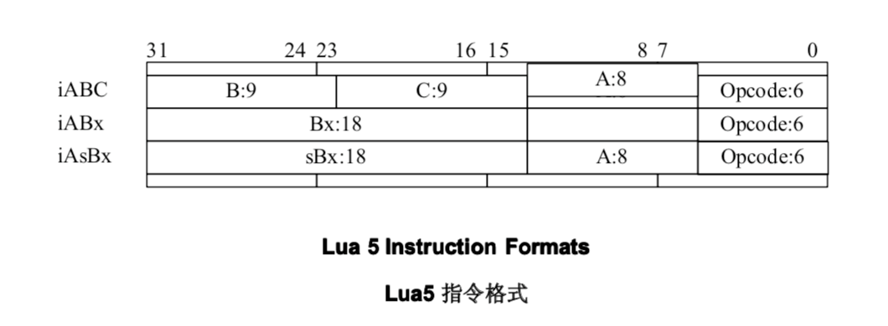

# Lua字节码

lua自己码的定义都在lopcode.h中

## 字节码的类型

```c
typedef enum {
/*----------------------------------------------------------------------
name		args	description
------------------------------------------------------------------------*/
//在寄存器间拷贝值
OP_MOVE,/*	A B	R(A) := R(B)					*/
//把一常量载入寄存器
OP_LOADK,/*	A Bx	R(A) := Kst(Bx)					*/
//将bool值载入寄存器
OP_LOADBOOL,/*	A B C	R(A) := (Bool)B; if (C) pc++			*/
//将空值载入一系列寄存器
OP_LOADNIL,/*	A B	R(A) := ... := R(B) := nil			*/
//将upvalue读入寄存器
OP_GETUPVAL,/*	A B	R(A) := UpValue[B]				*/

//将一个全局变量读入寄存器
OP_GETGLOBAL,/*	A Bx	R(A) := Gbl[Kst(Bx)]				*/
//将一个表元素读入寄存器
OP_GETTABLE,/*	A B C	R(A) := R(B)[RK(C)]				*/

//将一个寄存器值写入全局变量
OP_SETGLOBAL,/*	A Bx	Gbl[Kst(Bx)] := R(A)				*/
//将一个寄存器值写入上值
OP_SETUPVAL,/*	A B	UpValue[B] := R(A)				*/
//将一个寄存器值写入表元素
OP_SETTABLE,/*	A B C	R(A)[RK(B)] := RK(C)				*/

//创建新表
OP_NEWTABLE,/*	A B C	R(A) := {} (size = B,C)				*/

//为调用对象方法做准备
OP_SELF,/*	A B C	R(A+1) := R(B); R(A) := R(B)[RK(C)]		*/

//加法操作
OP_ADD,/*	A B C	R(A) := RK(B) + RK(C)				*/
//减法操作
OP_SUB,/*	A B C	R(A) := RK(B) - RK(C)				*/
//乘法操作
OP_MUL,/*	A B C	R(A) := RK(B) * RK(C)				*/
//除法操作
OP_DIV,/*	A B C	R(A) := RK(B) / RK(C)				*/
//取模操作
OP_MOD,/*	A B C	R(A) := RK(B) % RK(C)				*/
//取幂操作
OP_POW,/*	A B C	R(A) := RK(B) ^ RK(C)				*/
//一元负操作
OP_UNM,/*	A B	R(A) := -R(B)					*/
//逻辑非操作
OP_NOT,/*	A B	R(A) := not R(B)				*/
//取长度操作
OP_LEN,/*	A B	R(A) := length of R(B)				*/

//连接一系列寄存器操作
OP_CONCAT,/*	A B C	R(A) := R(B).. ... ..R(C)			*/

//无条件跳转
OP_JMP,/*	sBx	pc+=sBx					*/

//相等测试
OP_EQ,/*	A B C	if ((RK(B) == RK(C)) ~= A) then pc++		*/
//小于测试
OP_LT,/*	A B C	if ((RK(B) <  RK(C)) ~= A) then pc++  		*/
//小于等于测试
OP_LE,/*	A B C	if ((RK(B) <= RK(C)) ~= A) then pc++  		*/

//bool测试，带条件跳转
OP_TEST,/*	A C	if not (R(A) <=> C) then pc++			*/ 
//bool测试，带条件跳转以及赋值
OP_TESTSET,/*	A B C	if (R(B) <=> C) then R(A) := R(B) else pc++	*/ 

//调用闭包
OP_CALL,/*	A B C	R(A), ... ,R(A+C-2) := R(A)(R(A+1), ... ,R(A+B-1)) */
//执行尾调用
OP_TAILCALL,/*	A B C	return R(A)(R(A+1), ... ,R(A+B-1))		*/
//返回操作
OP_RETURN,/*	A B	return R(A), ... ,R(A+B-2)	(see note)	*/

//迭代器数字for循环
OP_FORLOOP,/*	A sBx	R(A)+=R(A+2);
			if R(A) <?= R(A+1) then { pc+=sBx; R(A+3)=R(A) }*/
//初始化数字for循环 
OP_FORPREP,/*	A sBx	R(A)-=R(A+2); pc+=sBx				*/

//迭代一般形式的for循环
OP_TFORLOOP,/*	A C	R(A+3), ... ,R(A+2+C) := R(A)(R(A+1), R(A+2)); 
                        if R(A+3) ~= nil then R(A+2)=R(A+3) else pc++	*/ 
//设置表的一系列数组元素
OP_SETLIST,/*	A B C	R(A)[(C-1)*FPF+i] := R(A+i), 1 <= i <= B	*/

//关闭用作upvalue的一系列局部变量
OP_CLOSE,/*	A 	close all variables in the stack up to (>=) R(A)*/
//创建一函数原型的闭包
OP_CLOSURE,/*	A Bx	R(A) := closure(KPROTO[Bx], R(A), ... ,R(A+n))	*/
//可变参数赋给寄存器
OP_VARARG/*	A B	R(A), R(A+1), ..., R(A+B-1) = vararg		*/
} OpCode;
```

## 字节码的储存格式

字节码的格式被分成了3种类型：
iABC、iABx、iAsBx
如下图



其中ABC为寄存器的位置

## 二进制程序块

4 bytes
二进制签名，识别是否为lua二进制块

1 bytes
高16进制是主版本号
低16进制是低版本号

1 bytes
0=官方版本

1 bytes
字节序定义，0=大尾，1=小尾

1 bytes
int的大小，缺省为4

1 bytes
size_t的大小，缺省为4

1 bytes
instruction的尺寸，缺省为4

1 bytes
lua_Number的大小，缺省为8

1 bytes
整数标志，缺省为0
0=浮点数，1=整数类型

在x86平台，缺省头部字节是
1B4C7561 51000104 04040800

## 二进制块的函数块

//TODO:二进制块的函数块

## 指令记法

R(A)
寄存器A（由指令中的字段A指定）

R(B)
寄存器B（由指令中的字段B指定）

R(C)
寄存器C（由指令中的字段C指定）

PC
程序计数器

Kst(n)
常量表中的元素n

Upvalue[n]
索引为n的upvalue的名字

Gbl[sym]
符号sym引用的全局变量

RK(B)
寄存器B或者常量索引

RK(C)
寄存器C或者常量索引

sBx
适用于所有跳转到的有符号位移（字段sBx中）