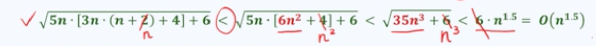
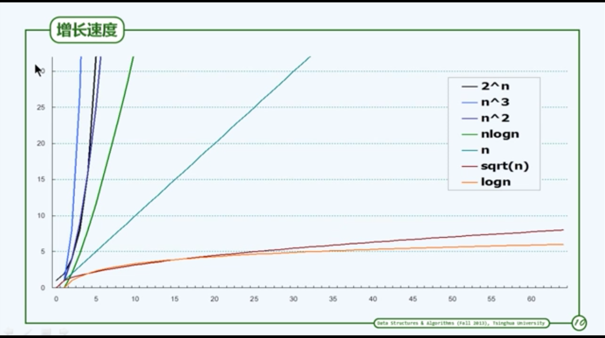

# 数据结构与算法

## 绪论

1. 什么是计算
2. 评判DSA的优劣的参照（直尺）
3. 度量DSA性能的尺度（刻度）
4. DSA性能度量的方法
5. DSA的设计以及其优化

1. 理论模型和实际性能的差异
2. DSA优化的极限（下界）

## 计算

* 规律技巧
* 高效低耗

算法的简单定义：
计算 = 信息处理
借助某种工具，遵照一定规则，以明确而机械的形式进行。

计算模型 = 计算机 = 信息处理工具

输入    待处理的信息
输出    经过处理的信息
正确性  的确可以解决指定的问题
确定性  任一的算法都可以描述为一个基本操作组成的序列
可行性  每一个操作都可以实现，且在常数时间内完成
有穷性  在有限步之后输出

## 有穷性

Hailstrone的例子
程序未必是算法，如果不能确定这个程序是有穷的。

## 好算法

* 正确的
* 健壮
* 可读性
* 效率（最重要的）：速度尽可能快，存储空间尽可能少


## 计算模型

数据结构和算法服务于计算，
计算又服务于应用

首先我们要学会度量：

两个方面：
* 正确性：
算法与问题要求一致
* 成本：
运行时间+所需存储时间
如何度量如何比较

问题实例的规模往往是决定计算成本的主要因素
规模接近，计算成本也接近

稳妥起见，只关注最坏情况。

## 特定问题 + 多个算法

如何判定算法优劣

不同的算法可能更适用于不同规模的输入
不同的算法可能适应于不同的输入
不同人写不同语言不同编译器
不同的硬件

## 图灵机  

## RAM

## 大O记号

更迅速抓住DSA性能要害,不拘泥于细碎的东西。
随着计算规模的增长，计算成本如何增长。
渐进分析，当n >> 2 时，对于规模为n的输入。

渐进分析使用方法：

* 常系数可忽略
* 低次项可以忽略

这里是例子：


## 其他记号

我们可以在下图看到其他记号
看的是上界、下界、平均


### 常数复杂度 O(1)

常数的高阶运算也是常数复杂度

### 对数复杂度

* 对数复杂度，一般不标明底数
* 常数次幂无所谓（可当做常数）
* 对数多项式
* 这类的算法非常有效,无限接近于O(1)

### 多项式复杂度

* 低次项可以忽略
* 常系数可以忽略

### 线性复杂度 O(n)



## 算法分析

## 级数

算数级数
幂方级数
几何级数
收敛级数
几何分布
调和级数
对数级数

可以去读读具体数学（Concrete Mathematics）

## 循环与级数

```(C++)
for(int i = 0; i < n; i++){
    for(int j = 0; j < n; j++){
        Operatiuon(i, j)
    }
}
```

上述是一个算数级数

```(C++)
for(int i = 0; i < n; i++){
    for(int j = 0; j < i; j++){
        Operatiuon(i, j)
    }
}
```

上述也是一个算数级数

## 取非极端元素

气泡排序：扫描交换

## 气泡排序

## 封底估算

## 迭代与递归

 减而治之
 分而治之